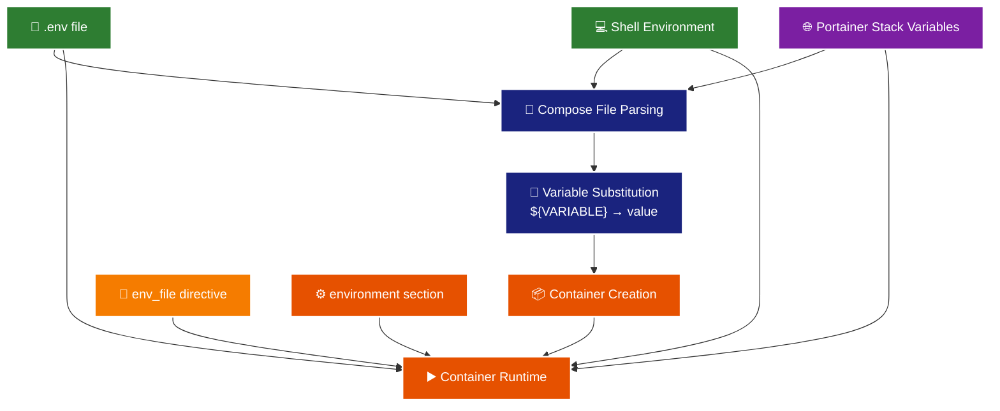

# Docker Compose & Portainer Environment Variables: The Complete Guide

## Table of Contents
1. [Overview](#overview)
2. [Understanding the Two Phases](#understanding-the-two-phases)
3. [Environment Variable Sources](#environment-variable-sources)
4. [Variable Resolution Hierarchy](#variable-resolution-hierarchy)
5. [Environment Section Syntax](#environment-section-syntax)
6. [Portainer Integration](#portainer-integration)
7. [Best Practices](#best-practices)
8. [Common Pitfalls](#common-pitfalls)
9. [Debugging Guide](#debugging-guide)

## Overview

Environment variables in Docker Compose and Portainer operate in **two distinct phases**, and understanding this is crucial for successful deployments:

1. **Compose-time**: When Docker Compose processes the YAML file and resolves `${variable}` placeholders
2. **Container runtime**: When variables are actually available inside running containers

Many deployment issues stem from confusion between these phases and which variable sources are available at each stage.

## Understanding the Two Phases

### Phase 1: Compose-Time Processing
Docker Compose reads your `docker-compose.yml` file and resolves all `${VARIABLE}` placeholders before creating containers. Only certain sources are available during this phase.

### Phase 2: Container Runtime
The final environment variables are injected into running containers. All sources contribute to this phase, following a specific hierarchy.



**Key Insight**: Only `.env` files, shell environment, and Portainer stack variables are available for compose-time substitution. Variables from `env_file` directive are container-runtime only.

## Environment Variable Sources

### 1. `.env` File (Auto-loaded)
- **Location**: Same directory as `docker-compose.yml`
- **Compose-time**: ✅ Available for `${VARIABLE}` substitution
- **Runtime**: ✅ Available in container (if declared in `environment` section)
- **Use case**: Default values, development settings

```bash
# .env
DATABASE_URL=postgresql://localhost:5432/myapp
DEBUG=true
```

### 2. `env_file` Directive
- **Location**: Specified in docker-compose.yml
- **Compose-time**: ❌ NOT available for `${VARIABLE}` substitution
- **Runtime**: ✅ Available in container automatically
- **Use case**: Environment-specific configs, secrets

```yaml
services:
  app:
    env_file:
      - ./config/production.env
      - ./secrets/database.env
```

### 3. `environment` Section
- **Location**: In docker-compose.yml service definition
- **Compose-time**: ❌ Not applicable (sets container vars)
- **Runtime**: ✅ Highest priority - overrides all other sources
- **Use case**: Service-specific overrides, explicit variable declaration

```yaml
services:
  app:
    environment:
      DATABASE_URL: "${DATABASE_URL}"  # From compose-time sources
      LOG_LEVEL: "info"                # Hard-coded value
      SERVICE_NAME:                    # Lookup from available sources
```

### 4. Shell Environment
- **Location**: Where `docker compose` command runs
- **Compose-time**: ✅ Available for `${VARIABLE}` substitution
- **Runtime**: ✅ Available in container (if declared in `environment` section)
- **Use case**: CI/CD pipelines, local development overrides

### 5. Portainer Stack Variables
- **Location**: Portainer UI "Environment Variables" section
- **Compose-time**: ✅ Available for `${VARIABLE}` substitution
- **Runtime**: ✅ Available in container (if declared in `environment` section)
- **Use case**: Production deployments, runtime configuration

## Variable Resolution Hierarchy

When multiple sources define the same variable, **higher priority wins**:

| Priority | Source | Applies To |
|----------|--------|------------|
| 1 | `environment` section | Container runtime only |
| 2 | Shell environment / Portainer stack variables | Both phases |
| 3 | `env_file` directive | Container runtime only |
| 4 | `.env` file | Both phases |

**Important**: For compose-time substitution, only priorities 2 and 4 are considered since `environment` and `env_file` don't affect compose-time processing.

## Environment Section Syntax

The `environment` section in docker-compose.yml supports different syntax patterns with distinct behaviors:

### 1. Variable Lookup (Implicit)
```yaml
environment:
  DATABASE_URL:  # No value = lookup from available sources
```
- Equivalent to `DATABASE_URL: "${DATABASE_URL}"`
- Searches compose-time sources: shell env, Portainer stack vars, `.env` file
- If not found, results in empty string

### 2. Explicit Substitution
```yaml
environment:
  DATABASE_URL: "${DATABASE_URL}"  # Explicit substitution
  API_KEY: "${API_KEY:-default}"   # With default value
```
- Uses `${VARIABLE}` syntax for clarity
- Supports default values with `${VAR:-default}`
- Same sources as implicit lookup

### 3. Hard-coded Values
```yaml
environment:
  LOG_LEVEL: "info"      # Always this value
  SERVICE_NAME: "api"    # Ignores any source files
```
- Literal string values
- Highest priority - overrides everything
- No substitution performed

### 4. Empty Values
```yaml
environment:
  OPTIONAL_FEATURE: ""   # Explicitly empty
```
- Sets variable to empty string
- Different from undefined variable
- Useful for disabling features

## Portainer Integration

> **Note:** This guide assumes Portainer 2.30.1 or later. Earlier versions had bugs with environment variable handling, especially with relative path volumes and variable substitution.<sup>1</sup>

### Stack Variables in Portainer
When deploying via Portainer, use the "Environment Variables" section for variables that need compose-time substitution:

```yaml
# In docker-compose.yml
services:
  app:
    image: "myapp:${APP_VERSION}"  # Resolved from Portainer stack vars
    environment:
      DATABASE_URL: "${DATABASE_URL}"
      REDIS_URL: "${REDIS_URL}"
```

**Portainer Environment Variables UI:**
```
APP_VERSION=1.2.3
DATABASE_URL=postgresql://db:5432/myapp
REDIS_URL=redis://redis:6379
```

### Best Practices for Portainer

1. **Use Stack Variables for Dynamic Configuration**
   ```yaml
   services:
     app:
       image: "myapp:${APP_VERSION:-latest}"
       environment:
         DATABASE_URL: "${DATABASE_URL}"
         ENVIRONMENT: "${ENVIRONMENT:-production}"
   ```

2. **Combine with env_file for Secrets**
   ```yaml
   services:
     app:
       env_file:
         - /opt/secrets/database.env  # Available in Portainer filesystem
       environment:
         APP_NAME: "${APP_NAME}"     # From Portainer stack variables
   ```

3. **Use Conditional Configuration**
   ```yaml
   services:
     app:
       env_file:
         - path: ./config/${ENVIRONMENT:-production}.env
           required: false
       environment:
         ENVIRONMENT: "${ENVIRONMENT:-production}"
   ```

## Best Practices

### 1. Always Declare Variables in `environment` Section
```yaml
# ✅ GOOD: Explicit and predictable
environment:
  DATABASE_URL: "${DATABASE_URL}"
  DEBUG: "${DEBUG:-false}"
  
# ❌ BAD: Relying on .env auto-loading to containers
# Variables in .env won't reach containers without explicit declaration
```

### 2. Use Default Values for Optional Configuration
```yaml
environment:
  # Required variables (will fail if not provided)
  DATABASE_URL: "${DATABASE_URL}"
  API_KEY: "${API_KEY}"
  
  # Optional variables with sensible defaults
  LOG_LEVEL: "${LOG_LEVEL:-info}"
  MAX_CONNECTIONS: "${MAX_CONNECTIONS:-100}"
  FEATURE_FLAG: "${FEATURE_FLAG:-false}"
```

### 3. Organize Variables by Purpose
```yaml
environment:
  # === Runtime Configuration ===
  ENVIRONMENT: "${ENVIRONMENT:-production}"
  LOG_LEVEL: "${LOG_LEVEL:-info}"
  
  # === External Services ===
  DATABASE_URL: "${DATABASE_URL}"
  REDIS_URL: "${REDIS_URL}"
  
  # === Feature Flags ===
  ENABLE_METRICS: "${ENABLE_METRICS:-true}"
  
  # === Service-Specific Overrides ===
  SERVICE_NAME: "user-api"  # Hard-coded for this service
```

### 4. Document Variable Sources and Requirements
```yaml
services:
  app:
    # Variables from .env or Portainer stack variables
    environment:
      # Required: Set in Portainer or .env
      DATABASE_URL: "${DATABASE_URL}"
      
      # Optional: Feature toggles
      ENABLE_CACHE: "${ENABLE_CACHE:-true}"
      
      # Service-specific: Always this value
      SERVICE_TYPE: "web"
    
    # Secrets and environment-specific configs
    env_file:
      - path: ./config/${ENVIRONMENT:-prod}.env
        required: false
```

### 5. Use Appropriate Sources for Different Variable Types

| Variable Type | Best Source | Reason |
|---------------|-------------|---------|
| Application version, environment name | Portainer stack variables | Dynamic deployment configuration |
| Database URLs, API endpoints | `.env` + Portainer override | Default for dev, override for prod |
| Secrets, credentials | `env_file` directive | File-based security, no compose-time exposure |
| Feature flags, toggles | `.env` or Portainer | Easy to change without rebuilding |
| Service-specific config | `environment` hard-coded | Service identity, no external dependency |

## Common Pitfalls

### 1. Assuming `.env` Variables Reach Containers Automatically
```yaml
# ❌ WRONG: Having this in .env
DATABASE_URL=postgresql://localhost:5432/myapp

# And expecting it in container without explicit declaration
# .env only affects compose-time, not container runtime!

# ✅ CORRECT: Must explicitly declare
environment:
  DATABASE_URL: "${DATABASE_URL}"
```

### 2. Using `env_file` Variables for Compose-Time Substitution
```yaml
# ❌ WRONG: This won't work
image: "myapp:${VERSION}"  # VERSION from env_file won't substitute

env_file:
  - config.env  # Contains VERSION=1.2.3

# ✅ CORRECT: Use .env or Portainer stack variables
# Put VERSION=1.2.3 in .env file or Portainer UI
```

### 3. Misunderstanding Variable Lookup Syntax
```yaml
environment:
  # These are equivalent:
  DATABASE_URL:              # Implicit lookup
  DATABASE_URL: "${DATABASE_URL}"  # Explicit lookup
  
  # This is different:
  DATABASE_URL: ""           # Explicitly empty
  DATABASE_URL: "hardcoded"  # Literal value
```

### 4. File Path Issues in Portainer
```yaml
# ❌ WRONG: Relative paths without enabling "Relative path volumes" option
env_file:
  - ./local-config.env

# ✅ CORRECT Option 1: Enable "Relative path volumes" in Portainer
env_file:
  - ./config/production.env  # Works with relative path volumes enabled

# ✅ CORRECT Option 2: Use absolute paths
env_file:
  - /opt/app/config/production.env
```

**Note**: In Portainer, enable "Relative path volumes" in the stack deployment options to use relative paths like `./config/`. Otherwise, use absolute paths that exist in the Portainer environment.

### 5. Forgetting Environment File Priority
```yaml
env_file:
  - base.env        # Loaded first
  - staging.env     # Overwrites base.env
  - secrets.env     # Overwrites staging.env

# Later files override earlier ones!
```

## Debugging Guide

### Check What Docker Compose Will Create
```bash
# See the final configuration with variables resolved
docker compose config

# See specific service configuration
docker compose config app

# Check if variables are being substituted
docker compose config | grep -i database_url
```

### Verify Container Environment
```bash
# See all environment variables in running container
docker compose exec app printenv | sort

# Check specific variable
docker compose exec app printenv DATABASE_URL

# Compare with what compose thinks it set
docker compose exec app env | grep DATABASE_URL
```

### Debug Variable Sources
```bash
# Test .env file loading
docker compose --env-file .env config

# Test with different env file
docker compose --env-file staging.env config

# Override with shell environment
DATABASE_URL="test://localhost" docker compose config
```

### Portainer-Specific Debugging
```bash
# In Portainer container console, check what variables are available
printenv | sort

# Check if env files are accessible
ls -la /path/to/env/files/

# Verify file contents
cat /opt/config/production.env
```

### Common Debug Commands
```yaml
# Add temporary debug service to your compose file
services:
  debug:
    image: alpine:latest
    command: |
      sh -c "
        echo '=== Environment Variables ==='
        printenv | sort
        echo '=== File System ==='
        ls -la /opt/config/ || echo 'Config directory not found'
        echo '=== Done ==='
        sleep 30
      "
    environment:
      - DATABASE_URL=${DATABASE_URL}
      - DEBUG_VAR=${DEBUG_VAR:-not-set}
    env_file:
      - path: /opt/config/app.env
        required: false
```

## Summary

Environment variables in Docker Compose and Portainer follow predictable rules, but success depends on understanding the **two-phase process**:

### Key Takeaways

1. **Compose-time vs Runtime**: Only certain sources (`.env`, shell env, Portainer stack vars) work for `${VARIABLE}` substitution
2. **Always Use `environment` Section**: Don't rely on implicit behavior - explicitly declare what containers need
3. **Choose the Right Source**: Use `.env` for defaults, `env_file` for secrets, Portainer for deployment configs
4. **Test Thoroughly**: Use `docker compose config` and `printenv` to verify your configuration

### Quick Reference

| Need | Use | Available For |
|------|-----|---------------|
| Dynamic image tags, conditional config | Portainer stack variables or `.env` | Compose-time + Runtime |
| Application secrets, environment configs | `env_file` directive | Runtime only |
| Default development values | `.env` file | Compose-time + Runtime |
| Service-specific overrides | `environment` section | Runtime only |
| CI/CD pipeline variables | Shell environment | Compose-time + Runtime |

### The Golden Rule

**Always verify your assumptions** by checking what actually reaches your containers:

```bash
# What compose will create
docker compose config

# What containers actually receive
docker compose exec service printenv
```

When these don't match your expectations, trace through the two-phase process to identify where the disconnect occurs.

---

## Footnotes

<sup>1</sup> **Portainer Version Requirement:** This guide was tested with Portainer 2.30.1. Earlier versions had several bugs affecting environment variable handling, particularly around relative path volumes and variable substitution in stack deployments. If you encounter unexpected behavior, ensure you're running Portainer 2.30.1 or later.
