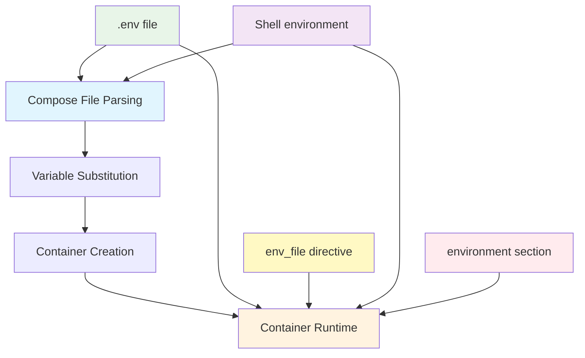

# Docker Compose Environment Variables: The Complete Developer's Guide

## Table of Contents
1. [Overview](#overview)
2. [Environment Variable Hierarchy](#environment-variable-hierarchy)
3. [How Environment Variables Flow](#how-environment-variables-flow)
4. [Test Results Analysis](#test-results-analysis)
5. [Best Practices](#best-practices)
6. [Common Pitfalls](#common-pitfalls)
7. [Portainer Specifics](#portainer-specifics)

## Overview

Environment variables in Docker Compose can be confusing because they exist in **two different contexts**:

1. **Compose-time**: Variables used by Docker Compose itself to build the configuration
2. **Runtime**: Variables that actually exist inside the running container

Understanding this distinction is crucial for debugging and properly configuring your applications.

## Environment Variable Hierarchy

Docker Compose follows a specific hierarchy when resolving environment variables. **Higher priority sources override lower priority ones**.

### Priority Order (Highest to Lowest)

| Priority | Source | Scope | When Applied |
|----------|--------|-------|--------------|
| 1 | `environment` section in docker-compose.yml | Container runtime | When container starts |
| 2 | Shell environment where `docker compose` runs | Both compose-time & runtime | During compose execution |
| 3 | `env_file` directive in docker-compose.yml | Container runtime only | When container starts |
| 4 | `.env` file in compose directory | Both compose-time & runtime | During compose parsing |

### Key Insight: Environment vs env_file vs .env

- **`environment` section**: Sets variables **inside the container** (runtime only)
- **`env_file` directive**: Loads variables for **container runtime only** (not available for compose-time substitution)
- **`.env` file**: Available for **both compose-time substitution AND container runtime**

## How Environment Variables Flow

### The Two-Phase Process



**Key Points:**
- **Compose-time** (Phase 1): Only `.env` file and shell environment available for `${variable}` substitution
- **Runtime** (Phase 2): All sources contribute to final container environment, with `environment` section having highest priority

1. **Phase 1 - Compose Time**: Docker Compose reads all sources and substitutes `${variable}` placeholders
2. **Phase 2 - Runtime**: Container starts with final environment variables

## Test Results Analysis

Let's analyze the actual test results to understand how this works in practice:

### Test Setup

Our test includes these sources:
- `.env` file (automatically loaded)
- `stack.env` file (loaded via `env_file`)
- `env/staging.env` file (loaded via conditional `env_file`)
- Portainer UI variables (simulated)

### Results Breakdown

#### Pattern 1: Variable Lookup (No Value Specified)

```yaml
# In docker-compose.yml environment section:
dotenv_empty:  # No value = lookup from available sources
```

| Source | Has Variable | Compose Result | Container Result | Explanation |
|--------|--------------|----------------|------------------|-------------|
| `.env` | `dotenv_empty=dotenv-empty-value` | `'dotenv-empty-value'` | `'dotenv-empty-value'` | ✅ **Correct**: `.env` variable found and used |
| `stack.env` | `stackenv_empty=stackenv-empty-value` | `''` | `''` | ✅ **Correct**: `env_file` variables not available for lookup |

**Key Insight**: When you specify `variable_name:` with no value, Docker Compose looks for that variable in available sources. Only `.env` files and shell environment are available for this lookup - `env_file` variables are not.

#### Pattern 2: Explicit Variable Substitution

```yaml
# In docker-compose.yml environment section:
dotenv_sub: "${dotenv_sub}"  # Explicit substitution from source
```

| Source | Has Variable | Compose Result | Container Result | Explanation |
|--------|--------------|----------------|------------------|-------------|
| `.env` | `dotenv_sub=dotenv-sub-value` | `'dotenv-sub-value'` | `'dotenv-sub-value'` | ✅ Substituted correctly |
| `stack.env` | `stackenv_sub=stackenv-sub-value` | `''` | `''` | ❌ **Not available for substitution**: `env_file` variables can't be used for `${var}` |

**Why the difference?** The `stack.env` and `staging.env` files are loaded via `env_file` directive, which only provides variables to the container at runtime - they're **not available for compose-time substitution**. Only `.env` files and shell environment variables can be used for `${variable}` substitution.

#### Pattern 3: Hard-coded Values

```yaml
# In docker-compose.yml environment section:
dotenv_hard: "hard"  # Hard-coded value ignores source
```

| Source | Has Variable | Compose Result | Container Result | Explanation |
|--------|--------------|----------------|------------------|-------------|
| All sources | `{source}_hard={source}-hard-value` | `'{source}-hard-value'` | `'hard'` | ✅ Hard-coded wins in container |

**Key Insight**: Compose-time shows source value, but container gets hard-coded value!

#### Pattern 4: Undeclared Variables

Variables exist in source files but are NOT listed in the `environment` section:

| Source | Has Variable | Compose Result | Container Result | Explanation |
|--------|--------------|----------------|------------------|-------------|
| `.env` | `dotenv_undeclared=dotenv-undeclared-value` | `'dotenv-undeclared-value'` | `''` | Compose sees it, container doesn't |
| `env/staging.env` | `stagingenv_undeclared=stagingenv-undeclared-value` | `''` | `'stagingenv-undeclared-value'` | Container gets it via env_file |

**Critical Discovery**: 
- **`.env` file**: Affects compose-time substitution but not container environment unless explicitly declared in `environment` section
- **`env_file` directive**: Only affects container environment, never available for compose-time substitution

## Best Practices

### 1. Always Use the `environment` Section

```yaml
# ✅ GOOD: Explicit declaration
environment:
  MY_VAR: "${MY_VAR:-default}"
  
# ❌ BAD: Relying on implicit behavior
# (just having it in .env file)
```

### 2. Use Default Values

```yaml
environment:
  DATABASE_URL: "${DATABASE_URL:-postgresql://localhost:5432/myapp}"
  DEBUG: "${DEBUG:-false}"
```

### 3. Organize by Source

```yaml
environment:
  # === Application Config (.env) ===
  APP_NAME: "${APP_NAME}"
  APP_VERSION: "${APP_VERSION}"
  
  # === Environment Specific (env_file) ===
  DATABASE_URL: "${DATABASE_URL}"
  REDIS_URL: "${REDIS_URL}"
  
  # === Runtime Overrides ===
  LOG_LEVEL: "debug"  # Hard-coded for this service
```

### 4. Document Your Variables

```yaml
environment:
  # Database connection (required)
  DATABASE_URL: "${DATABASE_URL}"
  
  # Feature flags (optional, defaults to false)
  ENABLE_FEATURE_X: "${ENABLE_FEATURE_X:-false}"
  
  # Service-specific override
  SERVICE_NAME: "api-service"  # Always this value
```

## Common Pitfalls

### Pitfall 1: Assuming .env Variables Are Available in Containers

```yaml
# ❌ WRONG ASSUMPTION
# Having this in .env:
MY_VAR=value

# And expecting it to be available in container without:
environment:
  MY_VAR: "${MY_VAR}"  # Must be explicit!
```

### Pitfall 2: Confusion Between Compose-Time and Runtime

```bash
# This shows compose-time substitution
docker compose config

# This shows what's actually in the container
docker compose exec service printenv
```

### Pitfall 3: Environment File Loading Order

```yaml
env_file:
  - .env              # Loaded first
  - stack.env         # Overwrites .env values
  - env/staging.env   # Overwrites previous values
```

## Portainer Specifics

### How Portainer Handles Environment Variables

1. **Stack Variables**: Set at stack level, available for compose-time substitution
2. **Service Environment**: Set at service level, goes directly to container
3. **Environment Files**: Must be available in the Portainer filesystem

### Portainer Best Practices

```yaml
# Use stack variables for compose-time substitution
environment:
  DATABASE_URL: "${DATABASE_URL}"  # From Portainer stack variables
  
# Use service environment for container-only variables
environment:
  SERVICE_NAME: "my-api"  # Hard-coded, no substitution needed
```

### Testing in Portainer

1. **Set Stack Variables**: Use the "Environment Variables" section when creating a stack
2. **Monitor Logs**: Use `printenv | sort` to see what actually made it to the container
3. **Debug Substitution**: Use `docker compose config` to see compose-time values

## Debugging Commands

### Check Compose-Time Values
```bash
# See what Docker Compose will create
docker compose config

# See specific service configuration
docker compose config my-service
```

### Check Runtime Values
```bash
# See all environment variables in running container
docker compose exec my-service printenv | sort

# Check specific variable
docker compose exec my-service printenv MY_VAR
```

### Debug Environment Files
```bash
# Test if environment file is readable
docker compose exec my-service cat /path/to/env/file

# See what files are being loaded
docker compose config --show-env-file
```

## Summary

Environment variables in Docker Compose follow a predictable hierarchy, but understanding the difference between **compose-time** and **runtime** is crucial. Always explicitly declare variables in the `environment` section, use default values, and test thoroughly in your target deployment environment.

The key takeaway: **Don't assume—always verify** what variables actually make it into your containers by checking `printenv` output.
